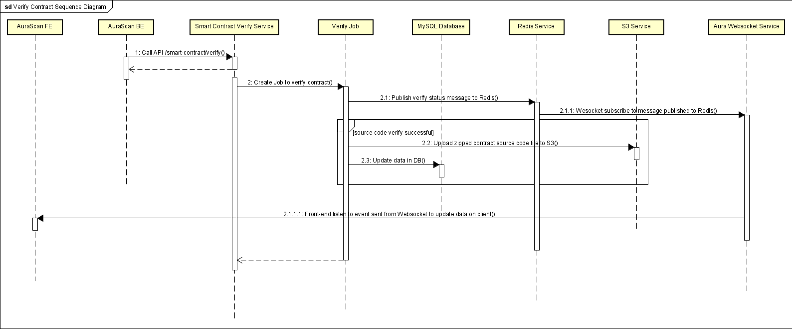

# Verify Smart Contract Application

## Target
This application provide API for Explorer app to verify if a smart contract source code truely belongs to a contract deployed on Network.

## Method
This project is built following the flow of verifying a smart contract of [CosmWasm documentation](https://docs.cosmwasm.com/docs/1.0/smart-contracts/verify/).

## Repo Structure
-   `/cloud`: Create connection to MySQL Database, S3 service and initialize redis client
-   `/docs`: Contains swagger documents
-   `/model`: Contains smart contract entity, request model, config, etc.
-   `/repository`: Contains services to query data from and update data to DB
-   `/script`: Contains shell script file to process verification step
-   `/service`: Contains functions to query data onchain through CLI commands
-   `/util`: Contains common functions

## Main Flow


## Prerequisite
### Go
You can set up Golang following the [official documentation](https://github.com/golang/go/wiki#working-with-go). This application require go version v1.17+.  

### Rust
The standard approach is to use rustup to maintain dependencies and handle updating multiple versions of cargo(v1.55.0+) and rustc, which you will be using.  

After [install rustup tool](https://rustup.rs/) make sure you have the wasm32 target:
```sh
rustup target list --installed
rustup target add wasm32-unknown-unknown
```

### Cargo generate
Install [cargo-generate](https://github.com/ashleygwilliams/cargo-generate) and cargo-run-script.
If not installed, please run the command below:

```sh
cargo install cargo-generate --features vendored-openssl
cargo install cargo-run-script
```

## Installation
```
cd $repo
go mod download
go build
```

## Usage
```
cd $repo
go run main.go
```